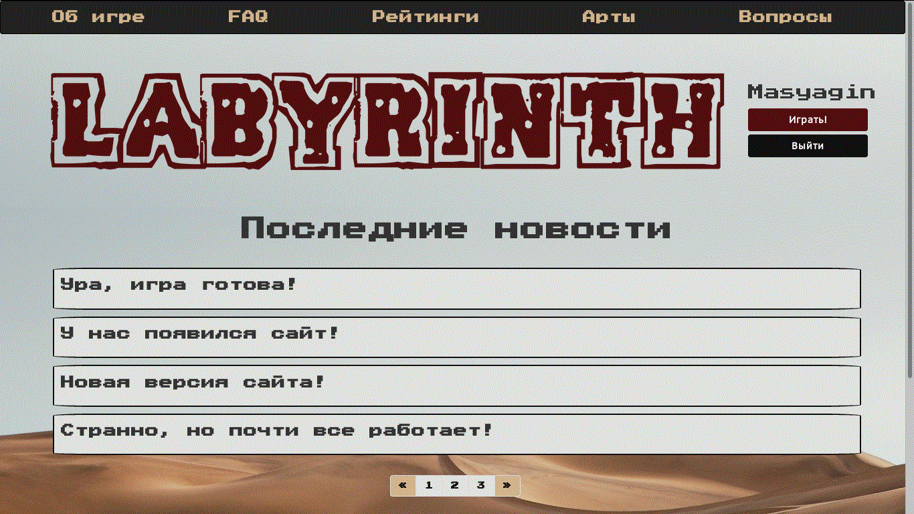
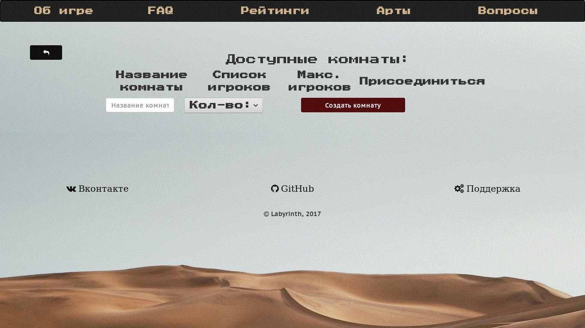
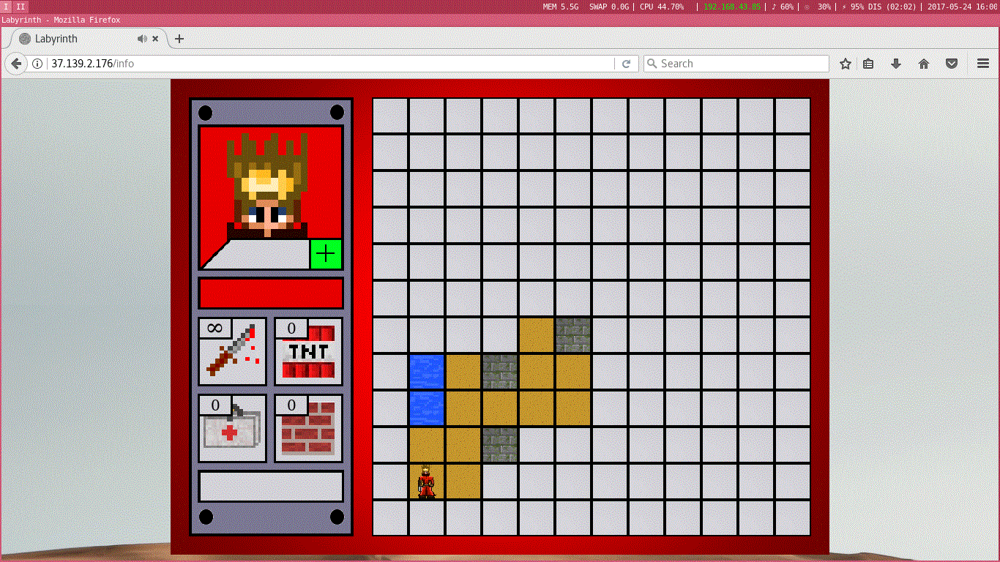
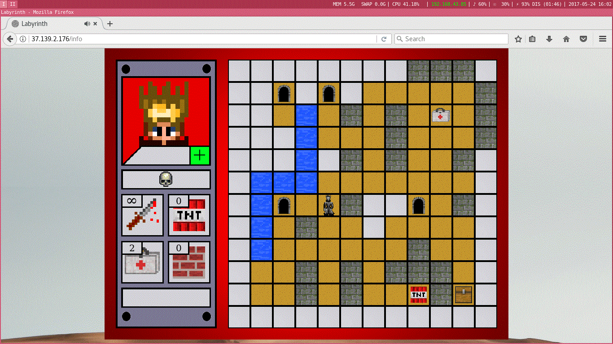

# Labyrinth 
Многопользовательская кроссплатформенная онлайн-игра по мотивам одноименной настольной игры.

Проектная работа открытого курса Python в Технопарке Mail.ru.

# Состав нашей команды:

- Масягин Михаил - [@masyagin1998](https://github.com/masyagin1998) 
- Барлука Александр - [@Nexterot](https://github.com/Nexterot) 
- Алесин Александр - [@sashaalesin](https://github.com/sashaalesin) 

# Описание

- Идея игры "Лабиринт" зародилась в Советском Союзе в начале 70-х годов XX века. "Бумажная стратегия" пришлась по душе огромному числу школьников, студентов и даже взрослых. В неё играли по всей стране! И сегодня интерес к игре не убывает (разработчики "подсадили" на бумажную войнушку не один десяток человек :D). Наша команда хочет рассказать как можно большему количеству человек о "Лабиринте", именно по этому мы решили превратить его из настольной игры в онлайн стратегию!

# Словарик

-  "Карта" - поле 14 x 10 клеток. Изначально видна только та клетка, на которой расположен ваш герой (остальные покрыты "Туманом"). После перехода на новую клетку, туман с неё исчезает, карта обрастает новыми подробностями. Всё игровое поле окружено неразрушимой стеной, в которой есть несколько выходов на свободу. Воспользоваться ими можно только в том случае, когда у вас ненулевое здоровье, а в рюкзаке лежит заветный клад ;)
-  "Дорога" - любая клетка, на которую можно наступить.
-  "Стена" - клетка, при попытке хода на которую, вы остаётесь на месте.
-  "Река" - специальная зона на карте, помеченная синим цветом со стрелочкой. Если игок попадает в конец реки, её устье, то ничего не происходит, если на какую-либо другую занятую ей клетку, то он моментально оказывается в устье.
-  "Кротовая нора" - клетка, при попадании на которую вы в одно мнгновение оказываетесь на другой клетке-норе, связанной с данной. Все клетки-норы пронумерованы. Например, если на карте есть две норы с номером 1 и две норы с номером 2, то из 1-ого типа можно перейти только в 1-ый, а из 2-го только во 2-ой.
-  "Арсенал" - клетка, при попадании на которую, у вас в рюкзаке появляется какая-либо полезная вещь: пистолет, мина, жучок или материал для постройки стены.
-  "Больница" - клетка, при попадании на которую при нулевом здоровье, ваше здоровье становится 100-процентным, а при ненулевом - вы получаете аптечку :)
-  "Клад" - именно этот небольшой сундук является причиной нескончаемых войн в мире Лабиринта!
-  "Мина" - ну а что тут говорить? Мина она и в Африке мина: наступил... Бах!!! И нет тебя. Здоровье упало до нуля, все вещи из рюкзака выпали на радость противникам... Топай в больницу :(
-  "Бомба" - позволяет разрушить любую стену в игре (кроме внешней, конечно же).
-  "Бетон" - позволяет создать искусственную стену.

# Правила игры

- От 2-x до 5 игроков произвольно размещаются на карте. Все делают ходы по очереди. За один ход можно либо пойти в одном из 4 направлений, либо совершить одно из возможных действий: установить или деактивировать бомбу, взорвать или создать стену, выстрелить из пистолета или поставить жучок. Задача игроков: как можно быстрее найти клад и вынести его за пределы карты. Если игрока убивают, то он теряет все вещи из рюкзака и становится неактивным до тех пор, пока не дойдёт до больницы.

# Инструменты:

Все вычисления - на стороне сервера, js используется только для отрисовки.

- Front-end: веб-интерфейс JS + Phaser

- Game server: игровой сервер Python3 + Websockets

- Http server: основной сервер Python aiohttp + jinja2

- База данных sqlite3

# ToDo:

В дальнейшем мы хотим добавить в игру следующие возможности:

- Защита сервера и перенос его части на django + nginx
- "Медведь" - жестокий убийца, настоящий монстр! Абсолютно неуязвим ко всем видам оружия! :D Основная сила моба заключается в том, что он ходит гораздо чаще обычных игроков. Так, если в битве участвуют 4 человека, то на их полный цикл ходов медведь сходит не один, а четыре раза. Каждый раз медведь идёт в направлении, противоположном направлению хода одного из игроков.
- "Жучок" - хотите почувствовать себя агентом спецслужб? Да? Тогда жучок точно создан для вас! :D Просто расположите его на произвольной клетке и ждите. Как только на жучка наступит ваш противник, вы будете знать обо всех его перемещениях даже если он зайдёт в неизвестную вам область карты!
- "Пистолет" - основное оружие игры. Пуля из него летит до первой стены. Если в вас попали 9 грамм свинца - готовьтесь распрощаться с 1/3 вашего здоровья...

# Скриншоты

> 

> 

> 

> 

